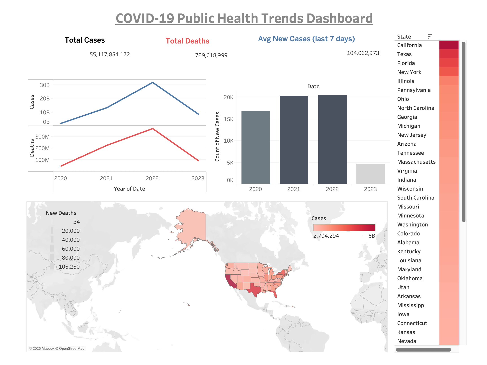

# Public Health Data Pipeline - COVID-19 Analytics

## Project Overview

This project implements a complete ETL pipeline to collect, process, store, and visualize COVID-19 case data for US states. The goal is to automate daily ingestion of public health data, enrich it with calculated metrics, and provide insightful visualizations to support data-driven decision-making.

## Features

- **Automated Data Extraction:** Daily download of COVID-19 state-level data from The New York Times repository.
- **Raw Data Storage:** Uploads raw CSV data to AWS S3, serving as a scalable data lake.
- **Data Transformation:** Cleans and enriches data by calculating new daily cases and deaths per state.
- **Data Warehouse:** Stores processed data in a PostgreSQL database, optimized for analytics.
- **Workflow Orchestration:** Uses Apache Airflow to schedule and manage the ETL pipeline reliably.
- **Visualization:** Interactive Tableau dashboard to explore COVID-19 trends by date and state.

## Architecture Diagram

[Data Source (NYT CSV)] --> [Airflow ETL Pipeline] --> [AWS S3 (Raw Data)] 

|

v

[PostgreSQL Data Warehouse]

|

v

[Tableau Dashboard]

## Tech Stack

| Component          | Technology                |
|--------------------|---------------------------|
| Programming        | Python (Pandas, Airflow)  |
| Cloud Storage      | AWS S3                    |
| Database           | PostgreSQL                |
| Workflow           | Apache Airflow            |
| Visualization      | Tableau                   |

## Setup & Usage

1. **Airflow Pipeline:**  
   - Schedules daily extraction and processing of COVID-19 data.
   - Uploads raw data to S3 and loads transformed data into PostgreSQL.

2. **PostgreSQL:**  
   - Hosts a table `covid_state_metrics` with enriched COVID metrics.

3. **Tableau Dashboard:**  
   - Connects to PostgreSQL to visualize trends.
   - (COVID_PUBLICDATA_ANALYTICS.twb)
     
  

